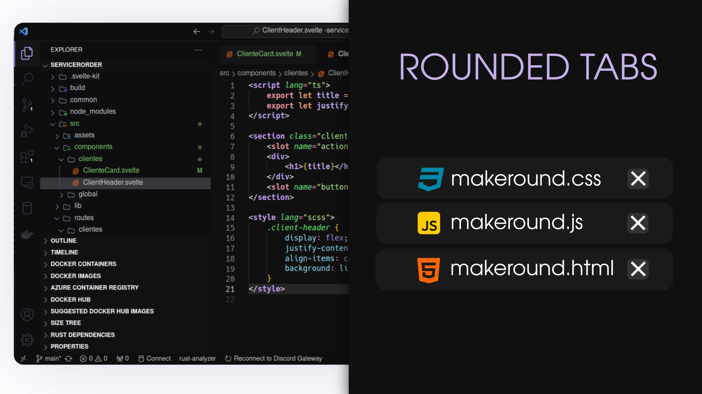

# Drkryz Rounded Tabs

Add rounded edges to your vscode guides. Make almost everything more modern!

## Commands

### Configure Theme
- **Command:** `drkryz-roundedtabs.configure_now`
- **Description:** Configures the theme with rounded tabs.
- **Instructions:** Run the command, enter your sudo(linux) password when prompted, and restart VS Code to apply the changes. For Windows, follow the same procedure but running vscode as administrator, remembering that in both cases vscode has the "standard" installations

### Restore Defaults
- **Command:** `drkryz-roundedtabs.restore`
- **Description:** Restores the default VS Code workbench style.
- **Instructions:** Run the command, enter your sudo(linux) password when prompted, and restart VS Code to apply the changes. For Windows, follow the same procedure but running vscode as administrator, remembering that in both cases vscode has the "standard" installations